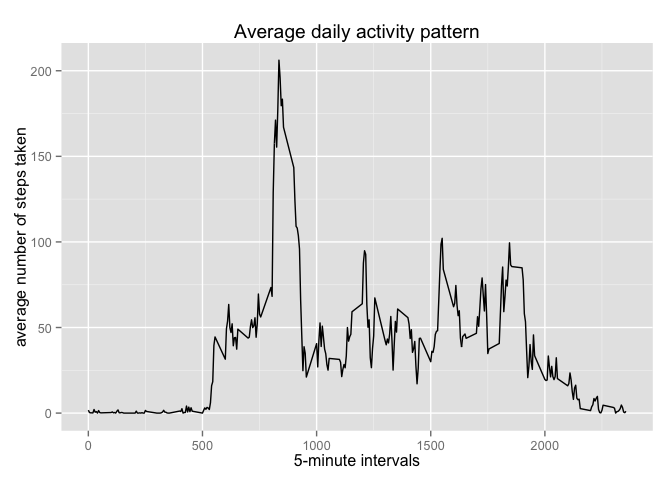
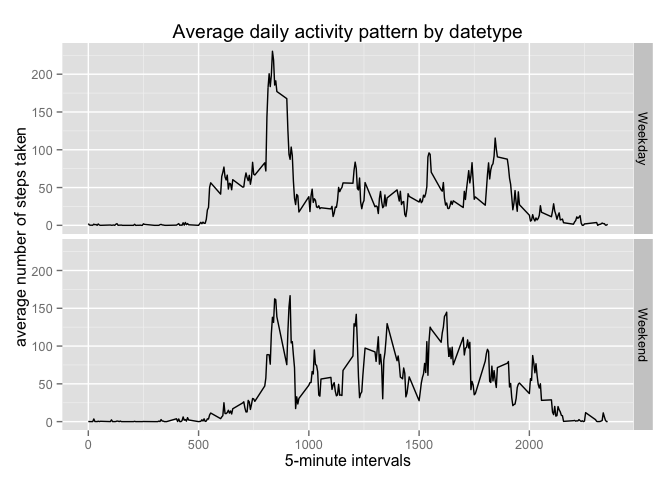

# Reproducible Research: Peer Assessment 1

## Loading and preprocessing the data
#####Load the data (i.e. read.csv())
• Load the data, configuring the appropriate columns to act as factors

```r
classes <- c("integer","factor","factor")
alldata <- read.table("activity.csv", header = TRUE, colClasses = classes, sep = ",", na.strings = "NA")
```

#####Process/transform the data (if necessary) into a format suitable for your analysis
• format the date column appropriately  
• Summarize data - total steps per day  
• Summarize data - average steps per interval (excluding NA data)  
• format the date to sort correctly for graphing  


```r
library(plyr)
alldata$date <- as.Date(alldata$date, format = '%Y-%m-%d')
sum_by_date <- ddply(alldata, "date",numcolwise(sum))
sum_by_date$date = as.factor(sum_by_date$date)
onlyStepData <- subset(alldata,!is.na(alldata$steps))
avg_by_interval <- ddply(onlyStepData, "interval",numcolwise(mean))
avg_by_interval$interval = as.character(avg_by_interval$interval)
avg_by_interval$interval = as.numeric(avg_by_interval$interval)
```


## What is mean total number of steps taken per day?
#####Make a histogram of the total number of steps taken each day  

```r
hist(sum_by_date$steps, xlab = "Total Steps", main = "Histogram of Total Steps per day")
```

 

#####Calculate and report the mean and median total number of steps taken per day

```r
mean(sum_by_date$steps[!is.na(sum_by_date$steps)])
```

```
## [1] 10766.19
```

```r
median(sum_by_date$steps[!is.na(sum_by_date$steps)])
```

```
## [1] 10765
```


## What is the average daily activity pattern?
#####Make a time series plot (i.e. type = "l") of the 5-minute interval (x-axis) and the average number of steps taken, averaged across all days (y-axis)

```r
library(ggplot2)
p <- ggplot(avg_by_interval,aes(interval, steps), type = "l")
p + geom_line() + xlab("5-minute intervals") + ylab("average number of steps taken") + ggtitle("Average daily activity pattern")
```

 

#####Which 5-minute interval, on average across all the days in the dataset, contains the maximum number of steps?
• find the maximum number of steps  
 

```r
max(avg_by_interval$steps)
```

```
## [1] 206.1698
```

• determine the interval that corresponds to the maximum number of steps 

```r
avg_by_interval$interval[avg_by_interval$steps == max(avg_by_interval$steps)]
```

```
## [1] 835
```

## Imputing missing values
#####Calculate and report the total number of missing values in the dataset (i.e. the total number of rows with NAs)

```r
count(is.na(alldata$steps))
```

```
##       x  freq
## 1 FALSE 15264
## 2  TRUE  2304
```

There are 2304 missing values (ie. "NA")

#####Devise a strategy for filling in all of the missing values in the dataset. The strategy does not need to be sophisticated. For example, you could use the mean/median for that day, or the mean for that 5-minute interval, etc.
• Using calculated "average steps per interval data", for each entry in the original dataset where steps is NA, replace NA with the average steps for that interval  

#####Create a new dataset that is equal to the original dataset but with the missing data filled in.
• Summarize data - total steps per day (using imputed dataset)  

```r
imputeData <- alldata
suppressWarnings(imputeData$steps[is.na(imputeData$steps)] <- avg_by_interval$steps[match(alldata$interval, avg_by_interval$interval)])
isum_by_date <- ddply(imputeData, "date",numcolwise(sum))
```

#####Make a histogram of the total number of steps taken each day with the imputed data.


```r
hist(isum_by_date$steps, xlab = "Total Steps", main = "Histogram of Total Steps per day (imputed data)")
```

 

#####Calculate and report the mean and median total number of steps taken per day with the imputed data. 

```r
mean(isum_by_date$steps[!is.na(isum_by_date$steps)])
```

```
## [1] 10766.19
```

```r
median(isum_by_date$steps[!is.na(isum_by_date$steps)])
```

```
## [1] 10766.19
```

#####Do these values differ from the estimates from the first part of the assignment? What is the impact of imputing missing data on the estimates of the total daily number of steps?
The mean and the median do not differ much from the estimates in the first part of the assignment. The imputed values, derived from calculated averages, inflate the number of days where the total daily steps resemble the mean of the dataset.

## Are there differences in activity patterns between weekdays and weekends?
#####Create a new factor variable in the dataset with two levels -- "weekday" and "weekend" indicating whether a given date is a weekday or weekend day.
• convert date to day-of-week using the weekdays function  
• create a dataframe that maps day of week to the new factor variable  
• add datetype (ie. weekday/weekend) factor to the data frame  
• Summarize data - average steps per interval by datetype (using imputed data)  
• format the date to sort correctly for graphing  

```r
imputeData$dayofweek <- weekdays(imputeData$date)
datetype <- read.table(text="dayofweek datetype                       
Monday Weekday
Tuesday Weekday
Wednesday Weekday
Thursday Weekday
Friday Weekday
Saturday Weekend
Sunday Weekend", header=T)
imputeData$datetype <- datetype$datetype[match(imputeData$dayofweek, datetype$dayofweek)]
interval_by_datetype <- ddply(imputeData, c("interval","datetype"),numcolwise(mean))
interval_by_datetype$interval = as.character(interval_by_datetype$interval)
interval_by_datetype$interval = as.numeric(interval_by_datetype$interval)
```

#####Make a panel plot containing a time series plot (i.e. type = "l") of the 5-minute interval (x-axis) and the average number of steps taken, averaged across all weekday days or weekend days (y-axis).


```r
library(ggplot2)
g <- ggplot(interval_by_datetype, aes(interval, steps))
g  + geom_line(aes(group=datetype) ) + facet_grid(datetype ~ .) + xlab("5-minute intervals") + ylab("average number of steps taken") + ggtitle("Average daily activity pattern by datetype")
```

 
